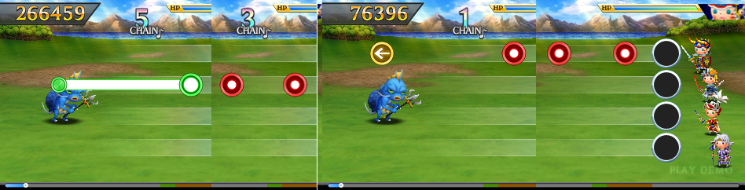

# Reverse-engineering the Final Fantasy: Theatrhythm track format

Recently, after picking up a neat New 3DS XL, I found myself playing a lot of
Final Fantasy Theatrhythm Curtains Call.  And as I was playing, I wondered how
difficult it would be to change the music or even create custom tracks for it.
Turns out, it's not that hard, and I ended up writing a custom track editor.

## Game background
The gameplay is rather simple if you've played any rhythm game before.  And if
you haven't played any rhythm game before, then here's how: just hit the notes
when they align with the on-screen circles; preferably in rhythm with the music.

Since the game is for 3DS, the gameplay is built around the stylus and touch
screen.  Notes come in three colors: red notes need just a tap, yellow notes
come with an arrow indicating a direction you must slide in, and green notes
require you to hold the stylus on the screen.  If you're not a fan of scratching
your screen with frantic stylus action and would rather develop arthritis early,
the game does let you play with sticks and buttons too.

There are three music stage variants: BMS, FMS and EMS.  BMS are battle stages
where notes are laid out on four rows.  In FMS, notes come on a single row, but
green held notes can have wavy shapes that you have to follow.  EMS stages have
a full-motion video background, and notes fade in and out of the screen rather
than coming from the left.

BMS and FMS stages each come in three difficulties: Beginner, Expert, Ultimate.
The higher the difficulty, the greater the number of notes, and the greater the
speed at which notes move around the screen.  For the vast majority of tracks,
Ultimate is the only challenging difficulty.

Being a FF game, there's also plenty of good old-fashioned JRPG grinding to be
found, but we won't have to concern ourselves with it.

## Into the cartridge
So, having never hacked a 3DS game before, I didn't know exactly where to start.
The first thing would be to look at the cartridge contents, and hope it wasn't
an encrypted dead-end.

Turns out, 3DS cartridges are encrypted.  You can dump them yourself with tools
from the homebrew community, and you would get a decrypted `3ds` or `cci` file.
Just as I was about to go through the process of dumping my own,
legally-acquired cartridge, I saw a crow drop something in my backyard.  There I
found a USB stick lying in the grass.  Now, I don't usually plug random USB
devices dropped by clumsy corvidae in my machines, but this time I made an
exception.  Among some disturbing jpegged closeups of bird cloacae, there was a
singular `fftcc.cia` file that caught my attention.

The number of different file formats used by the 3ds is [as large as it is
boring](https://www.3dbrew.org/wiki/Category:File_formats).  A CIA file is just
another way to distribute the cartridge contents, though this file is encrypted,
and you need to extract an ARM9 bootrom from a 3DS to decrypt it.  Before you
ask, yes, somehow the providential crow-stick did also contain a `boot9.bin`
file which fit the bill.

Using [ninfs](https://pypi.org/project/ninfs/), I can mount the CIA file using
fuse, as simply as:

    mount_cia fftc.cia mountpoint

And we're in.

I was surprised to see that many files are just plain text.  The `table` folder
for instance has a bunch of very interestingly-named CSV files:

    table
    ├── AbilityTable.csv
    ├── BgTable.csv
    ├── CardPackTable.csv
    ├── CardTable.csv
    ├── CharaTable.csv
    ├── ItemDropTable.csv
    ├── ItemTable.csv
    ├── MonsterPackTable.csv
    ├── MonsterTable.csv
    ├── MovieTable.csv
    ├── MusicTable.csv
    ├── ProficaTable.csv
    ├── RhythmPointTable.csv
    ├── SeriesTable.csv
    ├── SettingTable.map
    ├── SummonTable.csv
    ├── SupporterTable.csv
    ├── VehicleTable.csv
    └── VersusCpuTable.csv

Seems like it would be quite easy to mod abilities, cards or characters.  But
that's not what we're after.

The `MusicTable.csv` file is relevant, as it contains the list of all tracks,
along with a bunch of potentially useful, currently meaningless attributes and numbers:

    0100_BMS_001,1,0,1,0,100,100,Battle,Battle,battle,FINAL FANTASY,btl901,-,FALSE,FALSE,0,900,1,2,3,4,5,1,2,3,4,5,1,2,3,4,5,22.39,41.98,67.19,0,0,0
    0100_BMS_002,1,0,2,0,100,200,Miniboss Battle,Miniboss Battle,miniboss battle,FINAL FANTASY,btl902,-,FALSE,FALSE,0,900,6,7,8,9,10,6,7,8,9,10,6,7,8,9,10,23.92,43.25,90.49,1,1,1
    0100_BMS_003,1,0,3,0,100,300,Final Battle,Final Battle,final battle,FINAL FANTASY,btl012,-,FALSE,FALSE,921,1821,11,12,13,14,15,11,12,13,14,15,11,12,13,14,15,25.25,39.09,92.44,2,2,2
    0100_FMS_001,0,0,1,1,100,400,Main Theme,Main Theme,main theme,FINAL FANTASY,fld011,-,FALSE,FALSE,0,900,-1,-1,-1,-1,-1,-1,-1,-1,-1,-1,-1,-1,-1,-1,-1,23.97,46.48,61.91,3,3,3
    0100_FMS_002,0,0,4,10,100,500,Castle Cornelia,Castle Cornelia,castle cornelia,FINAL FANTASY,fld911,-,FALSE,FALSE,0,900,-1,-1,-1,-1,-1,-1,-1,-1,-1,-1,-1,-1,-1,-1,-1,20.77,33.36,69.96,4,4,4
    0100_FMS_003,0,0,1,1,100,600,Opening Theme,Opening Theme,opening theme,FINAL FANTASY,fld011,-,FALSE,FALSE,0,900,-1,-1,-1,-1,-1,-1,-1,-1,-1,-1,-1,-1,-1,-1,-1,25.05,37.85,62.79,5,5,5
    0100_FMS_004,0,0,5,6,100,700,Matoya's Cave,Matoya's Cave,matoya's cave,FINAL FANTASY,fld013,-,FALSE,FALSE,0,900,-1,-1,-1,-1,-1,-1,-1,-1,-1,-1,-1,-1,-1,-1,-1,27.14,51.32,76.44,6,6,6
    0100_FMS_005,0,0,5,5,100,800,Mt. Gulg,Mt. Gulg,mt. gulg,FINAL FANTASY,fld906,-,FALSE,FALSE,1675,2575,-1,-1,-1,-1,-1,-1,-1,-1,-1,-1,-1,-1,-1,-1,-1,24.64,41.72,72.01,7,7,7
    0100_FMS_006,0,1,7,11,100,900,Airship,Airship,airship,FINAL FANTASY,fld012,RID901,FALSE,FALSE,0,900,-1,-1,-1,-1,-1,-1,-1,-1,-1,-1,-1,-1,-1,-1,-1,25.96,42.56,61.99,8,8,8
    0100_FMS_007,0,0,6,7,100,1000,Sunken Shrine,Sunken Shrine,sunken shrine,FINAL FANTASY,fld907,-,FALSE,FALSE,0,900,-1,-1,-1,-1,-1,-1,-1,-1,-1,-1,-1,-1,-1,-1,-1,24.28,36.97,59.8,9,9,9
    [...]

One should be able to change a song's title here.  But these do not contain the
music or note data we want.  The aptly-named `music` folder does:

    music
    ├── [4.0K]  0100_BMS_001
    │   ├── [ 608]  music.bcsar
    │   ├── [4.4M]  music.dspadpcm.bcstm
    │   ├── [ 812]  trigger000.bytes.lz
    │   ├── [1.2K]  trigger001.bytes.lz
    │   └── [1.6K]  trigger002.bytes.lz
    ├── [4.0K]  0100_BMS_002
    │   ├── [ 608]  music.bcsar
    │   ├── [4.2M]  music.dspadpcm.bcstm
    │   ├── [ 836]  trigger000.bytes.lz
    │   ├── [1.3K]  trigger001.bytes.lz
    │   └── [1.9K]  trigger002.bytes.lz

These folders match the first field in the music table CSV, and the folder name
give it away: `0100_BMS_001` is the first BMS track for FF1, "Battle".  In each
folder, the file names and sizes are good hints.  The BCSTM files should be
audio files, and the `trigger` files must be the track notes: three files, one
for each difficulty setting.

The BCSTM files are indeed audio: `file` tells us they are 32000Hz stereo.
Thanks to the enthusiastic homebrew community, there are players and converters
out there BCSTM player.
[Openrevolution](https://github.com/ic-scm/openrevolution) worked like a charm.

## Track data
The trigger files have the LZ suffix, indicating LZ compression.  It's not
standard LZ though, it's LZ10/11, a variant apparently often used by Nintendo.
The decompression algorithm is [documented
here](http://problemkaputt.de/gbatek.htm#lzdecompressionfunctions), but there
are many tools that can decompress it.  I used
[nlzss](https://github.com/magical/nlzss).

As the `bytes` suffix may have implied, trigger files are binary.  At last, a
brain teaser.  Here's the hexdump of the first 100h bytes:

    0000: 01 00 00 00 85 1d 00 00  00 00 00 00 85 1d 00 00
    0010: 1e 0f 00 00 9c 10 00 00  9c 10 00 00 17 15 00 00
    0020: f9 13 00 00 86 00 00 00  ee 00 00 00 00 00 00 00
    0030: 00 00 00 00 00 00 00 00  00 00 00 00 00 00 00 00
    0040: 06 01 00 00 00 00 00 00  00 00 00 00 00 00 00 00
    0050: 00 00 00 00 00 00 00 00  4e 01 00 00 00 00 00 00
    0060: 00 00 00 00 00 00 00 00  00 00 00 00 00 00 00 00
    0070: 7e 01 00 00 01 00 00 00  00 00 00 00 00 00 00 00
    0080: 0e 01 00 00 00 00 00 00  ae 01 00 00 00 00 00 00
    0090: 00 00 00 00 01 00 00 00  00 00 00 00 00 00 00 00
    00a0: c5 01 00 00 00 00 00 00  00 00 00 00 01 00 00 00
    00b0: 00 00 00 00 00 00 00 00  0d 02 00 00 02 00 00 00
    00c0: 00 00 00 00 01 00 00 00  00 00 00 00 00 00 00 00
    00d0: 3d 02 00 00 04 00 00 00  00 00 00 00 01 00 00 00
    00e0: 00 00 00 00 00 00 00 00  6d 02 00 00 00 00 00 00
    00f0: 00 00 00 00 02 00 00 00  00 00 00 00 00 00 00 00

So this is where it gets interesting.  I had little to no experience
reverse-engineering a binary format.  When you are faced with a bunch of
numbers, how are you supposed to make sense of them?

Well, first of all, you gather all the clues you can.  Here we have quite a lot
of context: we know the file should contain notes data for a rhythm game.  Even
before looking at the raw bytes, we know there are three types of notes, so the
note type must be in there.  Notes also have a position in time, and that
position is almost certainly monotonically increasing.  In BMS at least, notes
also appear in one of four rows, so we can expect this information to be encoded
as well.

Second, you gather data.  We don't have just one trigger file, but three trigger
files per folder, and over 100 folders.  If we compare a few of these files, we
quickly see that the first byte is always `01` in BMS folders, `00` in FMS, and
`02` for EMS, and subsequent bytes are different between folders.  So the first
byte must code for the music stage type.  Furthermore, the 28h first bytes are
exactly the same for the three difficulties in one folder, but the remainder of
the files are different.  So difficulties share a common header.

Third, you experiment.  We have the game, so if we were to change a byte in that
trigger file and run the game on it, we could observe what that byte has
changed.  That's a very useful way to figure out what a given byte stands for,
especially for a simple format like this one where there is a direct connection
between the data it contains and what you see on the screen.

Now, notice that the file is mostly zeroes.  That's a good hint that the numbers
we are looking at are serialized as ints much larger than the values they
contain.  Tip: we can try to find the alignment of the bytes by changing the
width of the hex dump.  If we align it to 4 bytes:

    0000: 01 00 00 00
    0004: 85 1d 00 00
    0008: 00 00 00 00
    000c: 85 1d 00 00
    0010: 1e 0f 00 00
    0014: 9c 10 00 00
    0018: 9c 10 00 00
    001c: 17 15 00 00
    0020: f9 13 00 00
    0024: 86 00 00 00
    0028: ee 00 00 00
    002c: 00 00 00 00
    0030: 00 00 00 00
    0034: 00 00 00 00
    0038: 00 00 00 00
    003c: 00 00 00 00
    0040: 06 01 00 00
    0044: 00 00 00 00
    0048: 00 00 00 00
    004c: 00 00 00 00
    0050: 00 00 00 00
    0054: 00 00 00 00
    0058: 4e 01 00 00
    005c: 00 00 00 00
    0060: 00 00 00 00
    0064: 00 00 00 00
    0068: 00 00 00 00
    006c: 00 00 00 00
    0070: 7e 01 00 00
    0074: 01 00 00 00
    0078: 00 00 00 00
    007c: 00 00 00 00
    0080: 0e 01 00 00
    0084: 00 00 00 00
    0088: ae 01 00 00
    008c: 00 00 00 00
    0090: 00 00 00 00
    0094: 01 00 00 00
    0098: 00 00 00 00
    009c: 00 00 00 00
    00a0: c5 01 00 00

Well, it really does look like we just have a sequence of little-endian 32-bit
numbers.

Another clue: if we play that track in game, we can find that the beginner
difficulty has 134 notes, in expert it's 221, and in ultimate 296.  If we divide
the (uncompressed) file sizes by the number of notes we have:

    trigger_000: 3256 / 134 = 24.3
    trigger_001: 5344 / 221 = 24.2
    trigger_002: 7144 / 296 = 24.1

So, assuming the files mostly contain note data, we would have 24 bytes per
note, or 6 32-bit words.  And if that is the case, then that leaves exactly 40
bytes for the header, or 10 32-bit words.

We can reorder the hexdump to show the header on the first line, then 6
little-endian 32-bit words per line (upper 16 bits are not shown since it's all
zeroes):

    0000: 0001 1d85 0000 1d85 0f1e 109c 109c 1517 13f9 0086
    0028: 00ee 0000 0000 0000 0000 0000
    0040: 0106 0000 0000 0000 0000 0000
    0058: 014e 0000 0000 0000 0000 0000
    0070: 017e 0001 0000 0000 010e 0000
    0088: 01ae 0000 0000 0001 0000 0000
    00a0: 01c5 0000 0000 0001 0000 0000
    00b8: 020d 0002 0000 0001 0000 0000
    00d0: 023d 0004 0000 0001 0000 0000
    00e8: 026d 0000 0000 0002 0000 0000
    0100: 0285 0000 0000 0002 0000 0000
    0118: 02cc 0000 0000 0002 0000 0000
    0130: 02fc 0001 0000 0002 005a 0000
    0148: 032c 0000 0000 0003 0000 0000
    0160: 0344 0000 0000 0003 0000 0000
    0178: 038b 0002 0000 0003 0000 0000
    0190: 03d3 0004 0000 0003 0000 0000
    01a8: 0403 0001 0000 0002 0000 0000
    01c0: 0427 0001 0000 0002 0000 0000

Now we are definitely seeing a pattern.  Note that the first field on a line is
in increasing order, so that could very well code for the note position in time,
and notes are stored in the order the appear.  If we reference how the track
begins in-game (cf. screen collage below), we will see that the second field
matches the note type: red notes are 0, yellow notes are 1, green notes are 2.
Somewhat unexpectedly, there's also a type 4, but that matches the trigger that
ends a green note.  We had assumed only 3 different note types, but the game
needs more in order to differentiate between green notes started and finishers.

The third field is always zero in this track, so we don't know its purpose (same
for the sixth field).  The fourth matches the row the notes appear in.  The
fifth field is used only for yellow notes, and if you convert the values to
decimal you get a hint:

    010e = 270
    005a = 90

This is the angle of the slide arrow, in degrees.

## Onto editing
At this point, I had a pretty good guess of how the notes were encoded in the
file, so I coded up a viewer to check I had gotten it right.  Then I figured out
the remaining bits by changing values and noting how the game reacted.

See the [README](https://gitlab.com/mpiroot/rideau) for the full reversed format.

With the viewer in hand, I figured that turning it into an editor would be the
most convenient way to create custom tracks.  Well, fast-forward many hours
later, and I've got something bare bones but usable.  The editor can open
compressed `trigger_000.bytes.lz` files directly, as well as BCSTM files for
playback.  You can place and remove notes, edit their type, angle, etc.  You get
the gist.

To finish, here is a clip of a custom track I made in the editor, using "Clash
on the Big Bridge" from The Black Mages debut album as BGM, running on real
hardware:

If you've played the game, you might have noticed that these slanted green hold
lines look weird.  Even though all BMS built-in tracks always begin and end a
hold note on the same lane, the game actually supports starting and ending on
different lanes just fine.  I'm sure there are other hidden features to be
found.

Source code for the editor can be found
[there](https://gitlab.com/mpiroot/rideau).  To the curious souls who would be
interested in creating custom tracks for a 7-years old rhythm game on a dead
console: Enjoy.
